# 🌊 Plabon (প্লাৱন) — Corrective-RAG Flood & Disaster Relief Assistant

<div align="center">

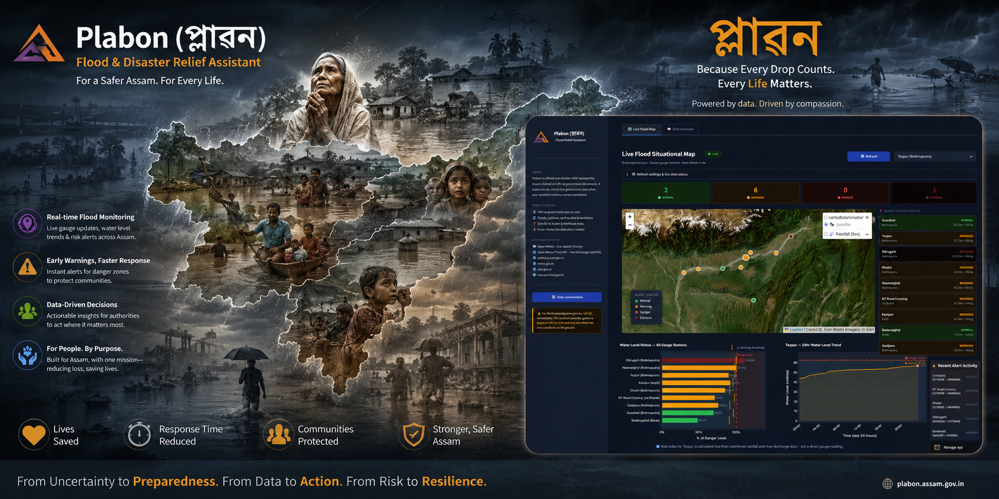

**Every year, Assam drowns. Plabon is built to help it fight back — with verified knowledge, live situational awareness, and an AI that knows the difference between what it knows and what it doesn't.**

[](https://python.org)
[](https://streamlit.io)
[](https://ai.google.dev)
[](https://langchain.com)
[](https://www.trychroma.com)
[](https://sbert.net)
[](https://python-visualization.github.io/folium/)
[](LICENSE)

[🌊 The Story](#-the-story--why-plabon-exists) · [🏗️ Architecture](#-system-architecture) · [🧠 C-RAG Pipeline](#-corrective-rag-pipeline--the-intelligence-core) · [🗺️ Live Flood Map](#-live-flood-situational-map) · [🚀 Getting Started](#-getting-started) · [📚 Knowledge Base](#-knowledge-base)

</div>

---

## 📌 Table of Contents

- [The Story — Why Plabon Exists](#-the-story--why-plabon-exists)
- [What Plabon Actually Does](#-what-plabon-actually-does)
- [Interface](#-interface)
- [System Architecture](#-system-architecture)
- [Corrective RAG Pipeline — The Intelligence Core](#-corrective-rag-pipeline--the-intelligence-core)
  - [Phase 1: Document Ingestion](#phase-1-document-ingestion--loading)
  - [Phase 2: Structure-Aware Chunking](#phase-2-structure-aware-chunking)
  - [Phase 3: Embeddings and Vector Store](#phase-3-embeddings--vector-store)
  - [Phase 4: Retrieval](#phase-4-retrieval)
  - [Phase 5: Corrective Grading — The C in C-RAG](#phase-5-corrective-grading--the-c-in-c-rag)
  - [Phase 6: Web Search Fallback](#phase-6-web-search-fallback)
  - [Phase 7: Answer Generation with Citations](#phase-7-answer-generation-with-citations)
- [Live Flood Situational Map](#-live-flood-situational-map)
- [Knowledge Base](#-knowledge-base)
- [Getting Started](#-getting-started)
- [Environment Variables](#-environment-variables)
- [Project Structure](#-project-structure)
- [Tech Stack](#-tech-stack)
- [Developer](#-developer)

---

## 🌊 The Story — Why Plabon Exists

**"Plabon" (প্লাৱন) is the Assamese word for flood.**

It is not a word that needs explanation to anyone who has grown up in Assam. It is a word that arrives with the monsoon every year — in news headlines, in government bulletins, in the voices of village announcements from a loudspeaker on a jeep driving through waterlogged lanes. It is, in some terrible sense, a word that defines the state's annual rhythm.

Assam sits astride the Brahmaputra — one of the world's largest river systems, fed by Himalayan glaciers and monsoon rains that can deposit over 2,000 mm of rainfall in a matter of weeks. Every year, the river swells. Every year, embankments breach. Every year, over 2,000 villages across 27 districts are submerged. People lose cattle, crops, homes, and lives — and then, once the water recedes, they rebuild. Until next year.

The problem is not only that flooding happens. It is that **when disaster strikes, people don't know what to do, where to go, or who to call.** Government SOPs exist — NDMA has published comprehensive flood management guidelines, ASDMA has district-level contingency plans, CWC publishes gauge station danger levels, IMD issues color-coded rainfall warnings. But these documents are dense, technical, and locked in PDFs that most people in an active emergency cannot access, read, or navigate under pressure.

There is another problem, subtler but equally dangerous: **generic AI assistants give generic answers.** Ask a large language model about flood evacuation in Assam and it will tell you something reasonable — something that reads as helpful but is sourced entirely from its parametric memory, unchecked, potentially outdated, not specific to your district, and not grounded in the official SOPs that emergency responders are actually following. In a life-safety domain, "reasonable-sounding" is not the same as "correct."

**Plabon was built to close this gap.**

It is not a complete solution to Assam's flood crisis — no software is. But it is a concrete step: a system that gives people direct access to the information embedded in official government disaster management documents, surfaces live warnings from authoritative government sources when static documents aren't enough, and knows clearly when it cannot answer something reliably — rather than hallucinating an answer with false confidence.

> *"The goal is not to replace the relief worker, the NDRF team, or the district collector. The goal is to make sure that someone standing in knee-deep water at 2am knows exactly what to do — before those people arrive."*

---

## 🎯 What Plabon Actually Does

Plabon is a **Corrective Retrieval-Augmented Generation (C-RAG)** system — a significant architectural step beyond a standard RAG chatbot. The distinction is not cosmetic. It is the difference between a system that always generates an answer and one that first asks whether it actually *has* the information needed to answer responsibly.

| Without Plabon | With Plabon |
|---|---|
| Generic internet results for flood safety | Answers grounded in NDMA, ASDMA, CWC, and IMD official documents |
| LLM confidently answers from parametric memory — including outdated or wrong facts | A dedicated grading step checks if retrieved documents actually address the question before answering |
| No way to know if current water levels are safe | Live web search fallback, restricted to authoritative government domains, fires automatically when static docs aren't enough |
| Fragmented information across multiple government websites | Single interface consolidating SOPs across multiple hazard types (floods, cyclones, earthquakes, landslides) |
| No visual situational awareness | Real-time interactive map of Assam with district-level alerts and Brahmaputra gauge station water levels |
| Emergency helplines buried in PDFs | Hardcoded, always-present emergency contact block in every response |
| One type of AI response regardless of query | Three distinct response paths — local-only, web-supplemented, or web-replaced — chosen automatically per query |

---

## 🖥️ Interface

Plabon is built with Streamlit, extended with a full custom CSS layer that delivers a professional dark-navy disaster management interface — not Streamlit's default aesthetic.

> 📸 **Chat Assistant — When retrived documents are RELEVANT :**
> 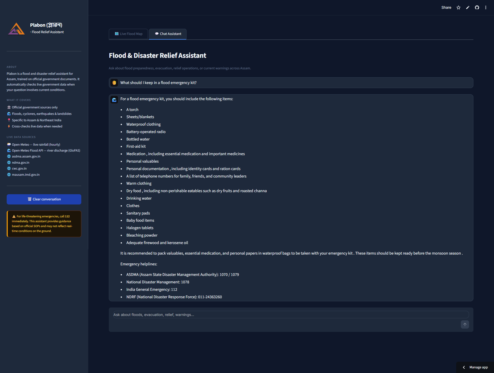

> 📸 **Chat Assistant — Answer with Live Data Badge - When the retrieved documents are not sufficient :**
> 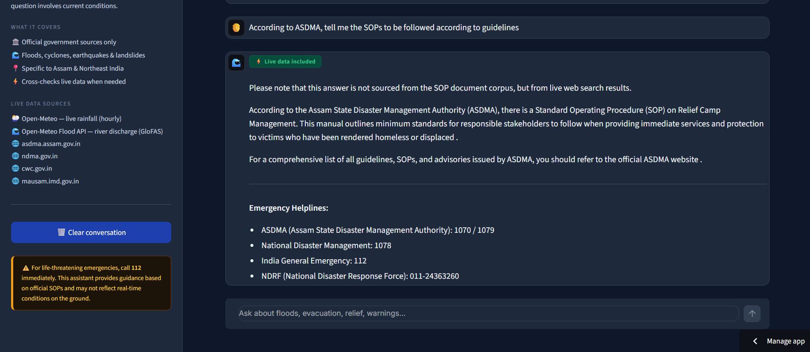

> 📸 **Live Flood Situational Map:**
> 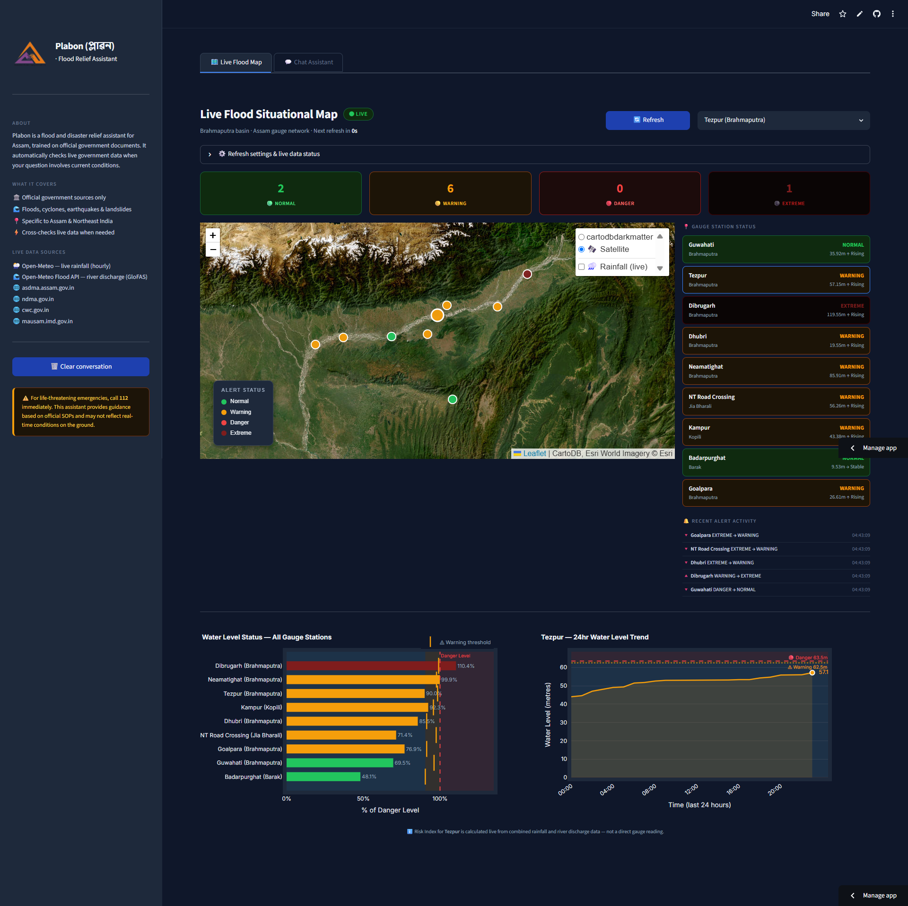

### Design System
- **Dark navy base** (`#0F172A` background) with Inter typography
- **Tab navigation** — Chat Assistant and Live Flood Map as first-class equal views
- **ASDMA logo** in the sidebar — visual signal of the project's official grounding
- **`⚡ Live data included` badge** — green, animated — appears only when web search supplemented the answer. Users understand something is real-time without needing to know what "AMBIGUOUS" means.
- **Suggested question chips** on first load — clickable, pre-populated with genuinely useful disaster queries
- **Sidebar disclaimer** — permanent amber warning block: emergency helpline 112 is always visible
- **Emergency helplines** hardcoded into every assistant response — too safety-critical to depend on retrieval surfacing them

---

## 🏗️ System Architecture

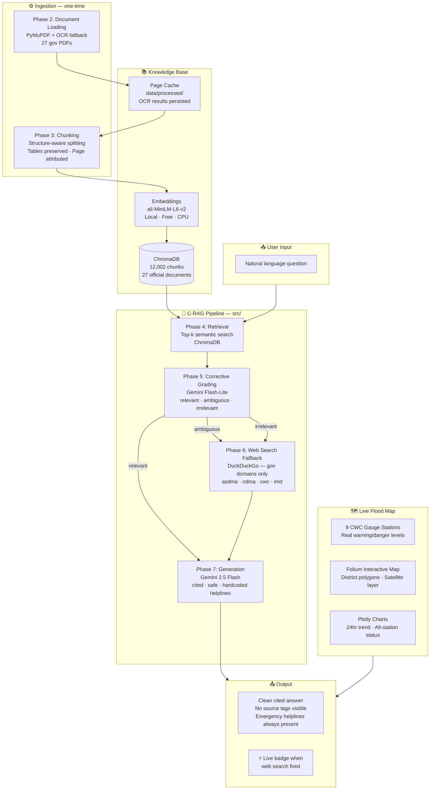

---

## 🧠 Corrective RAG Pipeline — The Intelligence Core

Standard RAG pipelines retrieve documents and pass them to a language model — always, regardless of whether what was retrieved is actually relevant to the question. This is a subtle but serious flaw in safety-critical domains: a system that retrieves a clause about earthquake retrofitting and uses it to answer a question about flood evacuation has failed the user without knowing it.

**Plabon implements C-RAG**: a correctiveness step between retrieval and generation that grades every retrieved chunk independently before deciding how to proceed. This is not a similarity score threshold. It is a dedicated Gemini Flash-Lite call that reads each chunk against the query and labels it — with a reason — as relevant, ambiguous, or irrelevant. The label determines which of three distinct generation paths is taken.

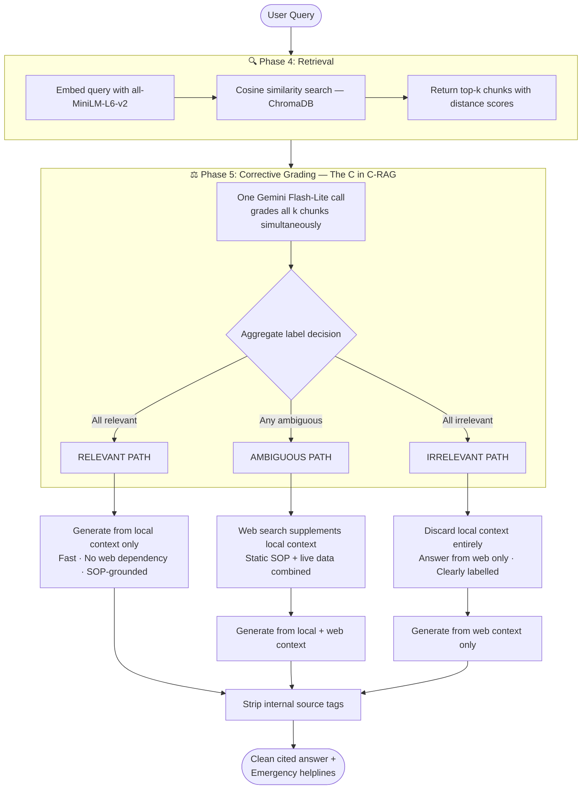

### Phase 1: Document Ingestion & Loading

The ingestion pipeline handles one of the most practically difficult aspects of working with official Indian government documents: they are frequently scanned PDFs, not text-layer PDFs. A flood forecasting manual from CWC may be 467 pages of photographed pages — zero extractable text without OCR.

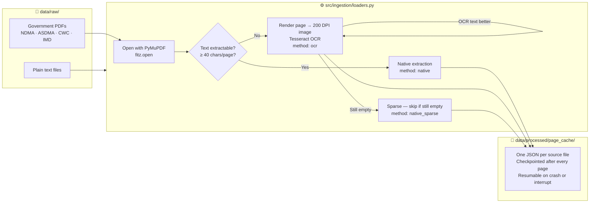

**Why OCR matters here:** A 467-page CWC flood forecasting manual where every page is a scanned image loses all its content without OCR. The loader uses a per-page cache — every page is written to disk immediately after processing, so a 20-minute OCR run on a large file is never repeated. On subsequent runs, the cache is read directly.

> 📸 **Ingestion pipeline running — showing per-page OCR progress:**
> 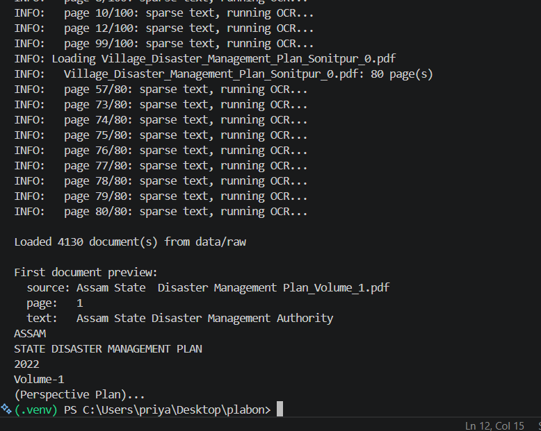


> 📸 **Cached data for chunking and building knowledge base**
> 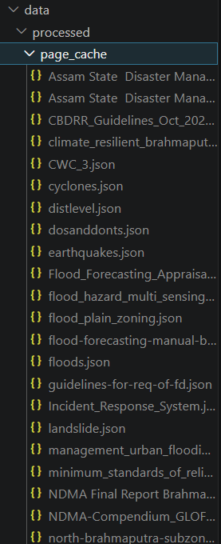

---

### Phase 2: Structure-Aware Chunking

Government SOPs have a specific problem: their most important content lives in numbered clauses (`4.2.1`, `SECTION 3`) and tables (river gauge danger levels by station). Generic paragraph splitting destroys this structure — splitting a clause mid-sentence or flattening a table into garbled prose.

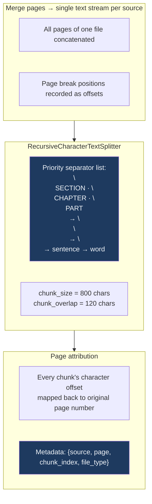

**The page attribution detail:** Chunking merges all pages first, splits across the merged text, then maps each resulting chunk's character position back to the original page number. This means a clause that spans pages 11–12 gets attributed to the correct page — not an arbitrary one — which is what makes later citations meaningful.

**Result:** `27 source documents → 4,130 pages → 12,002 chunks (avg 742 chars)`

---

### Phase 3: Embeddings & Vector Store

```mermaid
graph LR
    CHUNKS[12,002 text chunks<br/>with metadata] --> FILTER

    FILTER["Filter: drop fragments < 20 chars<br/>Removes stray page numbers<br/>and isolated section markers"]

    FILTER --> EMBED

    subgraph EMBED["🤖 sentence-transformers/all-MiniLM-L6-v2"]
        E1[Free · Local · CPU · ~80MB]
        E2[384-dimensional dense vectors]
        E3[Normalized — cosine similarity = dot product]
    end

    EMBED --> CHROMA

    subgraph CHROMA["ChromaDB Persistent Collection"]
        C1[Collection: flood_sop_kb]
        C2[Persist dir: ./chroma_db]
        C3[Batch indexing: 100 chunks/batch]
        C4[Reset-safe: wipe + rebuild on re-run]
    end
```

**Why `all-MiniLM-L6-v2` instead of a paid embedding API:**

This model was chosen deliberately. It runs entirely on CPU with no API cost and no rate limits — which matters during the one-time indexing of 27 government documents totalling 4,130 pages. At Google's `text-embedding-004` API pricing, embedding 12,002 chunks would incur a cost and a quota ceiling. `all-MiniLM-L6-v2` indexes everything in a single uninterrupted pass, costs nothing, and at 384 dimensions produces vectors that are compact enough to keep ChromaDB's total storage under 50MB.

---

### Phase 4: Retrieval

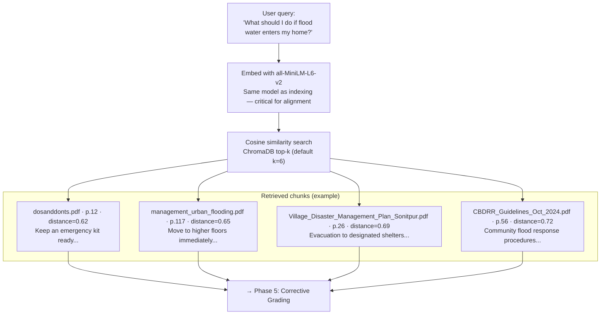

The retriever also supports an optional `source_filter` parameter for scoping queries to a specific government body — e.g., restricting to ASDMA documents only when the user names that authority. Distance scores travel with every chunk into the grading step, giving the grader full context.

---

### Phase 5: Corrective Grading — The C in C-RAG

This is the phase that separates Plabon from a standard RAG pipeline. Most RAG systems pass retrieved chunks directly to the LLM regardless of quality. Plabon inserts a dedicated grading call first.

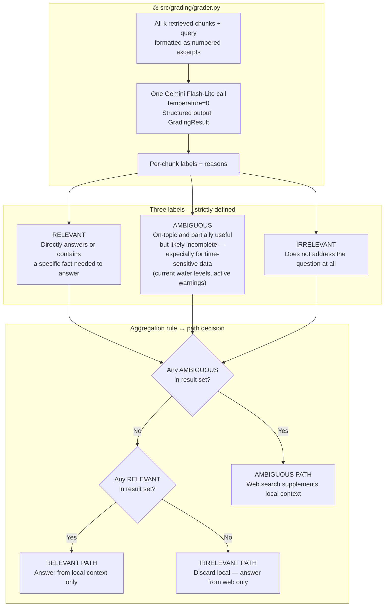

**Why the grader is a separate Gemini Flash-Lite call and not a similarity threshold:**

A cosine similarity threshold (e.g., "only use chunks with score > 0.7") cannot distinguish between a chunk that is topically related but temporally stale, and a chunk that genuinely answers the question. The grader can. It reads the actual content of the chunk against the actual content of the query and makes a semantic judgment. The reason field in each label also explains *why* a chunk was graded the way it was — this is visible in development and testable systematically.

**The AMBIGUOUS label is the most important design decision in the system.** It exists specifically for the case that no threshold can catch: the flood forecasting manual correctly explains how danger levels are defined and calculated — but it cannot tell you today's actual reading at the Tezpur gauge station. The grader recognises this: "This excerpt mentions Tezpur in the context of a travel line and gauge variation, but it is a static diagram and cannot provide the *current* water level as requested." The result is AMBIGUOUS — web search fires to supplement, not replace.

> 📸 **Grader output — two real queries showing the corrective step in action:**
> 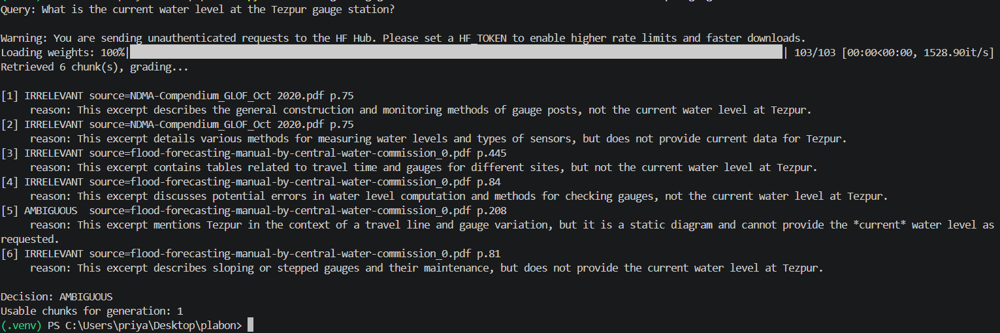

---

### Phase 6: Web Search Fallback

When the grader returns AMBIGUOUS or IRRELEVANT, Plabon does not fall back to the open internet. It restricts web search to four authoritative domains only.

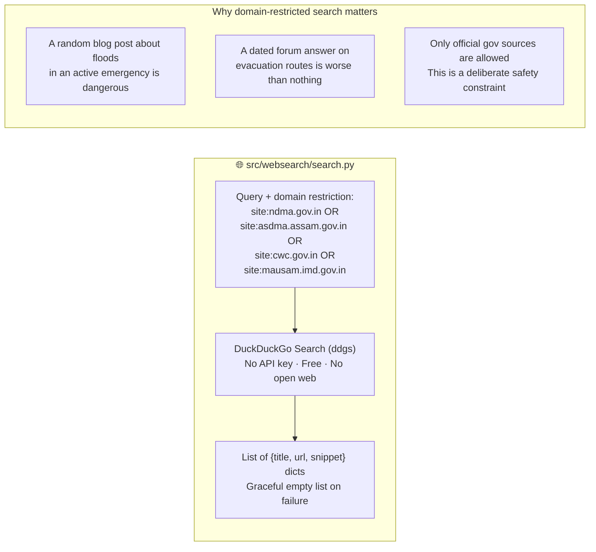

**AMBIGUOUS path:** Both the local SOP chunks and the web search results are passed to the generation step. The generator is instructed to prefer web results for current conditions and documents for SOPs and procedures.

**IRRELEVANT path:** Local context is discarded entirely. The generator is told explicitly that the answer is not from the SOP corpus and must label the response accordingly.

---

### Phase 7: Answer Generation with Citations

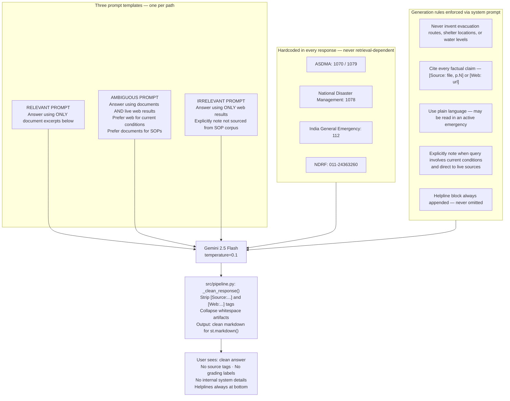

The internal source tags (`[Source: ndma_floods.pdf, p.12]`) exist in the raw LLM output to enable systematic testing and grounding verification during development. They are stripped by `_clean_response()` before the answer reaches the user interface — because a user in a flood emergency does not need to know the filename of the document their answer came from.

---

## 🗺️ Live Flood Situational Map

> 📸 **Live Flood Situational Map:**
> 

[Write here]

---

## 📚 Knowledge Base

The knowledge base was hand-curated from official government and international sources. Every document was selected because it covers a hazard type or procedure directly relevant to Assam's risk profile — riverine flooding, glacial lake outburst floods (GLOF) from Brahmaputra's glacial sources, seismic risk (Zone V), hill-district landslides, and cyclone vulnerability.

| Source | Document | Relevance |
|---|---|---|
| **ASDMA** | Assam State Disaster Management Plan 2022, Vol. 1 & 2 | State-level flood SOPs, strategic action plan |
| **ASDMA** | Sonitpur District Disaster Management Plan 2022 | District-specific evacuation routes and officer contacts |
| **ASDMA** | Sonitpur Flood Contingency Plan 2024-25 | River-level vulnerability data, block-wise contacts |
| **ASDMA** | Village Disaster Management Plan — Sonitpur | Household and village-level action SOPs |
| **NDMA** | Management of Floods (National Guidelines) | National flood response framework |
| **NDMA** | Management of Urban Flooding | Urban flood-specific SOPs |
| **NDMA** | Management of Earthquakes | Seismic risk — Assam is Zone V |
| **NDMA** | Management of Landslides & Snow Avalanches | Hill-district landslide SOPs |
| **NDMA** | GLOF Compendium 2020 | Glacial lake outburst flood risk — Brahmaputra |
| **NDMA** | NDMA Final Report — Brahmaputra River | Basin-wide flood management strategy |
| **NDMA** | Management of Cyclones | Cyclone preparedness |
| **NDMA** | Incident Response System | Command structure during active disasters |
| **NDMA** | Minimum Standards of Relief | Relief camp standards |
| **NDMA** | Temporary Shelters Guidelines | Shelter construction specs |
| **NDMA** | Do's and Don'ts — Multi-hazard | Public-facing emergency behavior |
| **NDMA** | CBDRR Guidelines 2024 | Community-based disaster risk reduction |
| **CWC** | Flood Forecasting Manual | River gauge methodology, danger level classification |
| **CWC** | Guidelines for Flood Forecasting Requirements | Operational forecasting framework |
| **CWC** | North Brahmaputra Subzone 2a | Basin-specific hydrological data |
| **CWC** | South Brahmaputra Subzone 2b | Basin-specific hydrological data |
| **CWC** | District Level Danger Levels | Gauge station danger levels by district |
| **CWC** | SOP Flood Forecasting April 2018 | Operational forecasting SOP |
| **CWC** | Flood Forecasting Appraisal Report 2022 | Annual assessment of the forecasting system |
| **Other** | Sphere Handbook 2018 | International minimum standards for humanitarian response |
| **Other** | Climate Resilient Brahmaputra | Long-term basin climate risk analysis |
| **Other** | Flood Plain Zoning Guidelines | Land-use planning for flood mitigation |
| **Other** | Flood Hazard Multi-sensing Satellite Data | Satellite-based flood hazard mapping |

**Corpus statistics:**

```
Total source documents : 27 official PDFs
Total pages processed  : 4,130
Total indexed chunks   : 12,002
Average chunk size     : 742 characters
Chunk size range       : 20 – 800 characters
Embedding model        : sentence-transformers/all-MiniLM-L6-v2
Vector dimensions      : 384
Vector store           : ChromaDB (persistent, local)
OCR coverage           : Automatic fallback for scanned pages
```

---

## 🚀 Getting Started

### Prerequisites

- Python 3.12+
- A free Google Gemini API key — [Get one at aistudio.google.com](https://aistudio.google.com/apikey)
- Tesseract OCR (for scanned PDF ingestion — not needed if using the pre-built index)
- Poppler (for PDF rendering — same caveat)
- Git

### Installation

```bash
# 1. Clone the repository
git clone https://github.com/priyanshu09102003/Plabon---A_flood_relief_Corrective_RAG
cd Plabon---A_flood_relief_Corrective_RAG

# 2. Create and activate virtual environment
python -m venv .venv

# Windows
.venv\Scripts\activate

# macOS/Linux
source .venv/bin/activate

# 3. Install dependencies
pip install -r requirements.txt
```

### Environment Setup

Create a `.env` file in the project root (copy from `.env.example`):

```env
# Required
GOOGLE_API_KEY=your_gemini_api_key_here

# Vector store
CHROMA_PERSIST_DIR=./chroma_db
CHROMA_COLLECTION_NAME=flood_sop_kb

# Embeddings (free, local, runs on CPU)
EMBEDDING_MODEL=sentence-transformers/all-MiniLM-L6-v2

# Model tiering — cheap grader, stronger generator
GRADER_MODEL=gemini-2.5-flash-lite
GENERATION_MODEL=gemini-2.5-flash

# Chunking
CHUNK_SIZE=800
CHUNK_OVERLAP=120

# Retrieval
RETRIEVAL_TOP_K=6

# OCR (leave blank to rely on PATH, or set explicit paths if PATH doesn't resolve)
OCR_ENABLED=true
OCR_DPI=200
TESSERACT_CMD=
POPPLER_PATH=
```

### Option A — Use the Pre-built Index (Recommended)

The repository includes the pre-built ChromaDB vector store. No ingestion run required:

```bash
# Verify the index
python -c "
from src.vectorstore.chroma_store import get_vectorstore
store = get_vectorstore()
count = store.get()['ids']
print(f'Vector store ready: {len(count)} chunks indexed')
"

# Launch the app
streamlit run app.py
```

### Option B — Build the Index from Scratch

If you have your own documents or want to rebuild:

```bash
# 1. Place PDFs in data/raw/
# 2. Run the full ingestion pipeline (OCR runs once, cached after)
python -m scripts.build_index data/raw

# 3. Launch the app
streamlit run app.py
```

> ⚠️ If your PDFs are scanned, install Tesseract and Poppler first.
> Windows: `winget install -e --id UB-Mannheim.TesseractOCR` and `winget install -e --id oschwartz10612.Poppler`
> macOS: `brew install tesseract poppler`

### Testing the C-RAG Pipeline

```bash
# Test retrieval
python -m src.retrieval.retriever What should I do during a flood evacuation?

# Test grading — two queries that should hit different paths
python -m src.grading.grader What is the current water level at the Tezpur gauge station?
python -m src.grading.grader What should I keep in an emergency kit before a flood?

# Test the full end-to-end pipeline
python -m src.generation.generator What relief is provided to flood-affected families in Assam?
```

---

## 🌐 Environment Variables

| Variable | Default | Description |
|---|---|---|
| `GOOGLE_API_KEY` | — | Gemini API key from aistudio.google.com |
| `CHROMA_PERSIST_DIR` | `./chroma_db` | Local path for ChromaDB persistent storage |
| `CHROMA_COLLECTION_NAME` | `flood_sop_kb` | ChromaDB collection name |
| `EMBEDDING_MODEL` | `sentence-transformers/all-MiniLM-L6-v2` | Free local embedding model |
| `GRADER_MODEL` | `gemini-2.5-flash-lite` | Gemini model for the corrective grading step |
| `GENERATION_MODEL` | `gemini-2.5-flash` | Gemini model for final answer generation |
| `CHUNK_SIZE` | `800` | Character size per chunk during ingestion |
| `CHUNK_OVERLAP` | `120` | Overlap between consecutive chunks |
| `RETRIEVAL_TOP_K` | `6` | Number of chunks retrieved per query |
| `OCR_ENABLED` | `true` | Set to `false` to skip OCR on scanned pages |
| `OCR_DPI` | `200` | DPI for page rendering before OCR |
| `TESSERACT_CMD` | — | Explicit path to tesseract binary (bypasses PATH) |
| `POPPLER_PATH` | — | Explicit path to poppler bin folder (bypasses PATH) |

---


## 🛠️ Tech Stack

| Component | Technology | Purpose |
|---|---|---|
| UI Framework | Streamlit 1.57+ | Web interface + custom dark CSS |
| Primary LLM | Gemini 2.5 Flash | Final answer generation |
| Corrective Grader | Gemini 2.5 Flash | Relevance grading — cheap, fast, separate call |
| LLM Framework | LangChain + LCEL | Pipeline composition, prompt management |
| Vector Store | ChromaDB | Free, local, persistent semantic search |
| Embeddings | sentence-transformers/all-MiniLM-L6-v2 | Free, local, 384-dim, CPU-only |
| PDF Parsing | PyMuPDF (fitz) | Native text extraction, page rendering |
| OCR | pytesseract + pdf2image | Scanned PDF fallback |
| Web Search | ddgs (DuckDuckGo) | Free, no API key, domain-restricted |
| Interactive Map | Folium + streamlit-folium | Leaflet.js-backed Assam flood map |
| Charts | Plotly | 24hr water level trends, station status |
| District Polygons | GeoJSON via datameet/maps | Assam district boundaries |
| Satellite Tiles | Esri World Imagery (WMTS) | Satellite map layer in Folium |
| Chunking | LangChain RecursiveCharacterTextSplitter | Structure-aware document splitting |
| Configuration | python-dotenv | .env file loading |

---

## 🚢 Deployment

### Streamlit Community Cloud

1. Fork or push the repository to GitHub (ensure `chroma_db/` is committed — it is not gitignored)
2. Visit [share.streamlit.io](https://share.streamlit.io) → **New app** → select repo → `app.py`
3. **Advanced settings → Secrets** → paste your secrets in TOML format:

```toml
GOOGLE_API_KEY = "your_key_here"
CHROMA_PERSIST_DIR = "./chroma_db"
CHROMA_COLLECTION_NAME = "flood_sop_kb"
EMBEDDING_MODEL = "sentence-transformers/all-MiniLM-L6-v2"
GRADER_MODEL = "gemini-2.5-flash-lite"
GENERATION_MODEL = "gemini-2.5-flash"
CHUNK_SIZE = "800"
CHUNK_OVERLAP = "120"
RETRIEVAL_TOP_K = "6"
OCR_ENABLED = "false"
TESSERACT_CMD = ""
POPPLER_PATH = ""
```

4. Deploy. First load takes ~30-60 seconds while the embedding model (~80MB) downloads from HuggingFace. Subsequent loads are instant due to Streamlit's `@st.cache_resource`.

> ⚠️ **Important:** The `chroma_db/` folder must be committed to GitHub for the deployed app to have a knowledge base. If it is gitignored, the retriever will return zero chunks, the grader will mark everything irrelevant, and every query will route to web search only — defeating the C-RAG architecture entirely.

---

## 👨‍💻 Developer

<div align="center">

**Priyanshu Paul**

*An aspiring Generative-AI Engineer*
*Building AI systems that are grounded, reliable, and built for real-world use — not just demos.*

[](https://github.com/priyanshu09102003)
[](https://www.linkedin.com/in/priyanshu-paul-59221228a/)
[](https://github.com/priyanshu09102003/Plabon---A_flood_relief_Corrective_RAG)

</div>

---

<div align="center">

**Plabon (প্লাৱন)** — Built for Assam. Grounded in official knowledge. Honest about what it doesn't know.

⭐ Star this repository if it was useful to you.

*This system is an AI-assisted information tool. In any active emergency, follow instructions from official local authorities and emergency responders. Call 112 immediately if lives are at risk.*

</div>